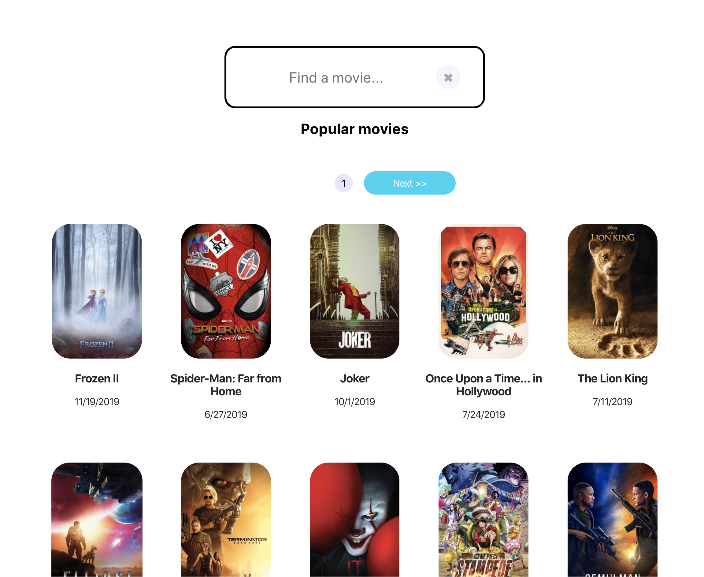

## Start app

# Development

## Clone
Clone the app locally: `git clone https://github.com/alexboots/moviedbplay.git`

The client and server must be started up seperatly. First, `cd moviedbplay` and start the server:

## server
cd into `/server` and run `yarn && yarn start` or `npm install && npm run start`

Next, we need to start the client. In a new terminal window:

## client
cd into `/client` and run `yarn && yarn start` or `npm install && npm run start`

The frontend is using create-react-app which sproxies all requests to the API. See package.json to change API port. 

### Production

There is currently no production build setup.

